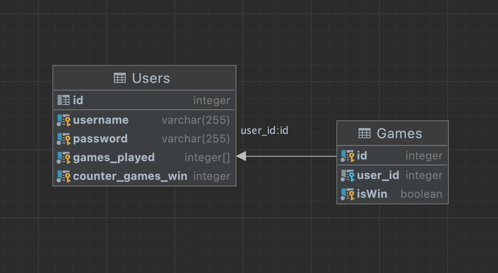
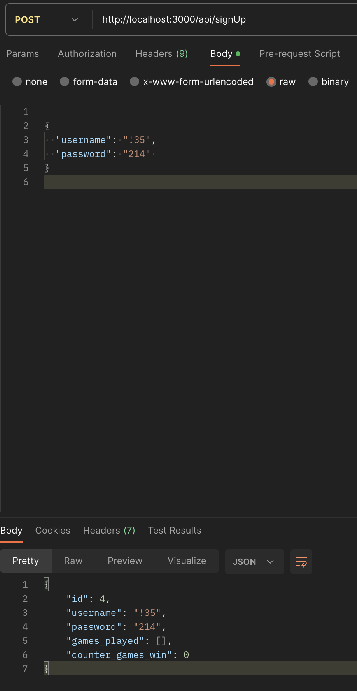
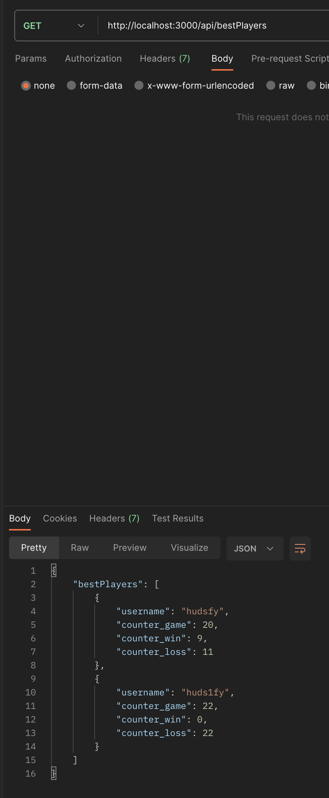
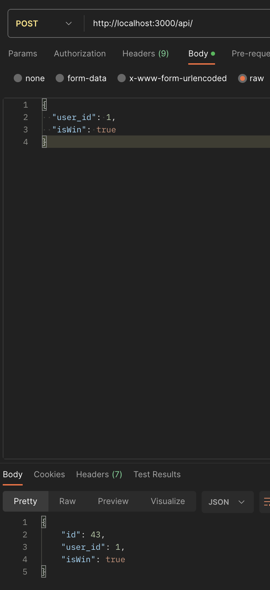

1. ***GET "/api/register"*** — клиент регистрируется. 

   Пример запроса

    `{
    "username": "maks",
    "password": "fda135"
    }`

    вернет 

2. ***GET "/api/signIn"*** — вход в систему. 

   Пример запроса

    `{
    "username": "maks",
    "password": "fda135"
    }`

    

3. ***GET "/api/bestPlayers"*** — получить массив объектов игроков, у которых число игр больше 10. 

    

4. ***POST "/api/"*** — добавление игры. 

   Пример запроса

    `{
    "user_id": 1,
    "isWin": true
    }`

    

5.  ***GET "/api/myStats/:user_id"*** — получение данных о пользователе. 

    